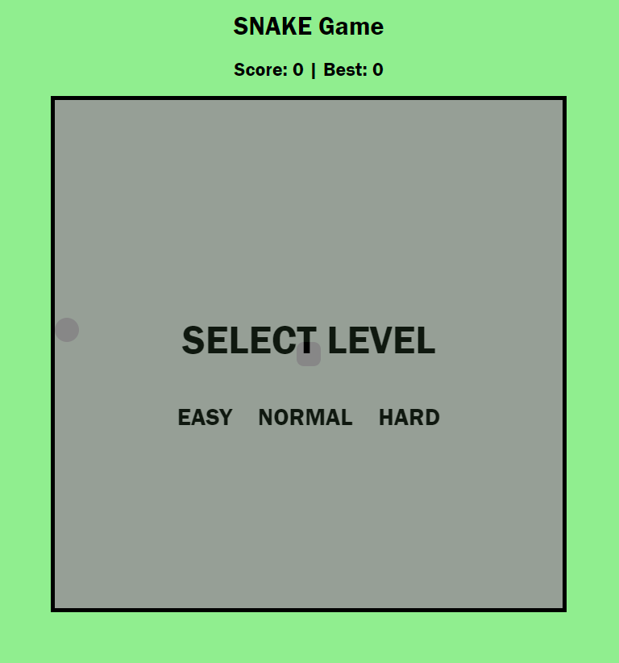
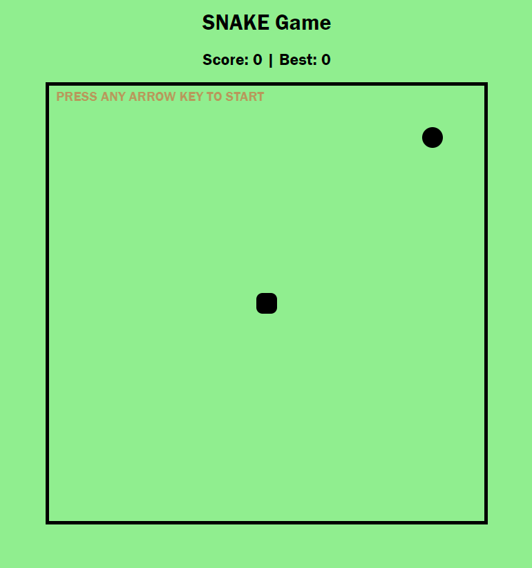
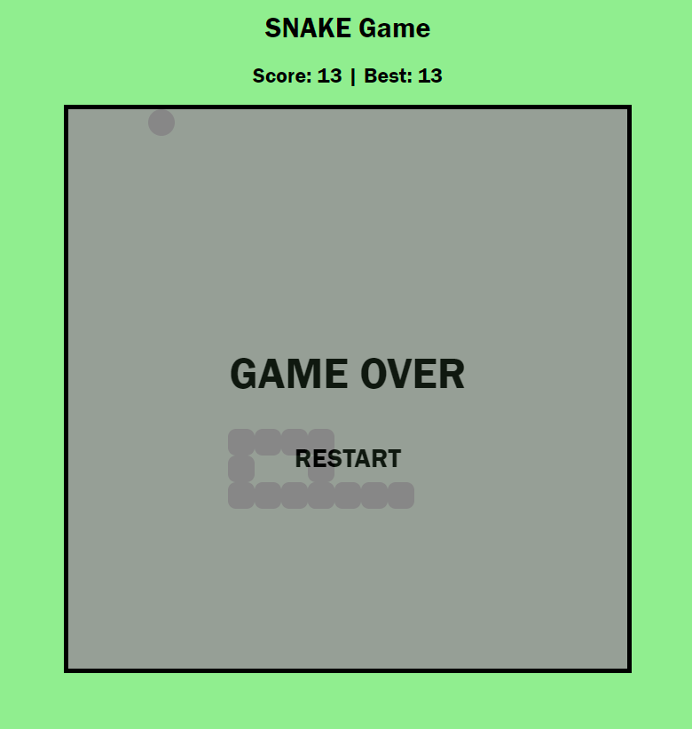

# This is a snake game!

### Intro

    Snake is a video game genre where the player maneuvers a growing line that becomes a primary obstacle to itself.
    The concept originated back in 1976 from Gremlin Industries. Since then hundreds of versions has been created. 
    After a version was preloaded on Nokia mobile phones in 1998, there was a surge of interest in snake games.

### Game Instruction

    Before starting the game, please choose one of the three options to determine the difficulty of the game A.K.A "game speed".

    Once the level has been chosen, you can press any arrow key to start playing!

    The snake(represented by a square) will grow its tail by eating an apple(represented by a circle). 1 apple eaton = 1 point scored!

    In order to score the highest points possible, player would need to try eating as many apples as possible.

    There is a scorebaord keeping track of best score as well as current score.
    
    player will loose if:

        1. it touches the boundaries.
        2. it touches itself.

    If the player fails to do so, game over page will pop up and the player is able to restart the game by pressing the restart button.

### Screenshot(s)

### Technologies Used

    The game is built using JavaScript, HTML, CSS(front-end development).

### Getting Started
    
    https://lolo19950603.github.io/snake-game/
